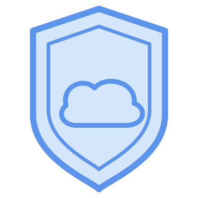

<div align="center">
  
</div>

# InfraGuard

**Policy Defined. Infrastructure Secured.**

**Infrastructure as Code (IaC) compliance pre-check CLI** for Alibaba Cloud ROS templates. Evaluate your ROS YAML/JSON templates against security and compliance policies **before deployment**.

> 💡 InfraGuard embraces **Policy as Code** - treating compliance policies as versioned, testable, and reusable code artifacts.

**Language**: English | [中文](README.zh.md)

## ✨ Features

- 🔍 **Pre-deployment Validation** - Catch compliance issues before they reach production
- 🎯 **Dual Scan Modes** - Static analysis or cloud-based preview validation
- 📦 **Built-in Rules** - Comprehensive coverage for Aliyun services
- 🏆 **Compliance Packs** - MLPS, ISO 27001, PCI-DSS, SOC 2, and more
- 🌍 **Internationalization** - Full support for English and Chinese
- 🎨 **Multiple Output Formats** - Table, JSON, and interactive HTML reports
- 🔧 **Extensible** - Write custom policies in Rego (Open Policy Agent)
- ⚡ **Fast** - Built in Go for speed and efficiency

## 🚀 Quick Start

### Installation

```bash
go install github.com/aliyun/infraguard/cmd/infraguard@latest
```

Or download pre-built binaries from [GitHub Releases](https://github.com/aliyun/infraguard/releases).

### Basic Usage

```bash
# Scan with a compliance pack
infraguard scan template.yaml -p pack:aliyun:quick-start-compliance-pack

# Scan with a specific rule
infraguard scan template.yaml -p rule:aliyun:ecs-instance-no-public-ip

# Scan with wildcard pattern (all rules)
infraguard scan template.yaml -p "rule:*"

# Scan with wildcard pattern (all ECS rules)
infraguard scan template.yaml -p "rule:aliyun:ecs-*"

# Generate HTML report
infraguard scan template.yaml -p pack:aliyun:mlps-level-3-pre-check-compliance-pack --format html -o report.html
```

## 📚 Documentation

For detailed documentation, please visit our [Documentation Site](https://aliyun.github.io/infraguard)

- **[Getting Started](https://aliyun.github.io/infraguard/docs/getting-started/installation)** - Installation and quick start guide
- **[User Guide](https://aliyun.github.io/infraguard/docs/user-guide/scanning-templates)** - Learn how to scan templates and manage policies
- **[Policy Reference](https://aliyun.github.io/infraguard/docs/policies/aliyun/rules)** - Browse all available rules and compliance packs
- **[Development Guide](https://aliyun.github.io/infraguard/docs/development/writing-rules)** - Write custom rules and packs
- **[CLI Reference](https://aliyun.github.io/infraguard/docs/cli/scan)** - Command-line interface documentation
- **[FAQ](https://aliyun.github.io/infraguard/docs/faq)** - Frequently asked questions
